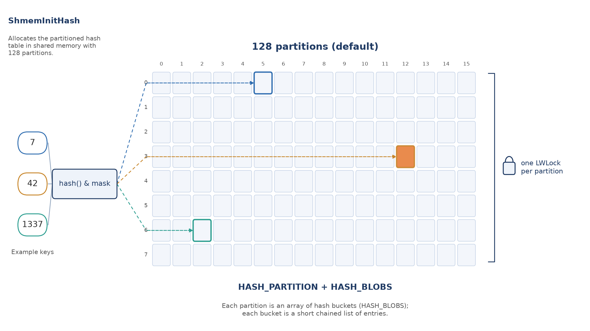
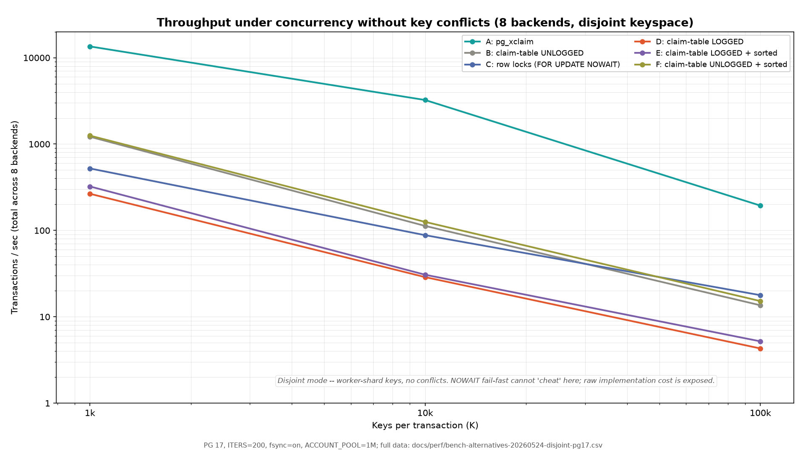
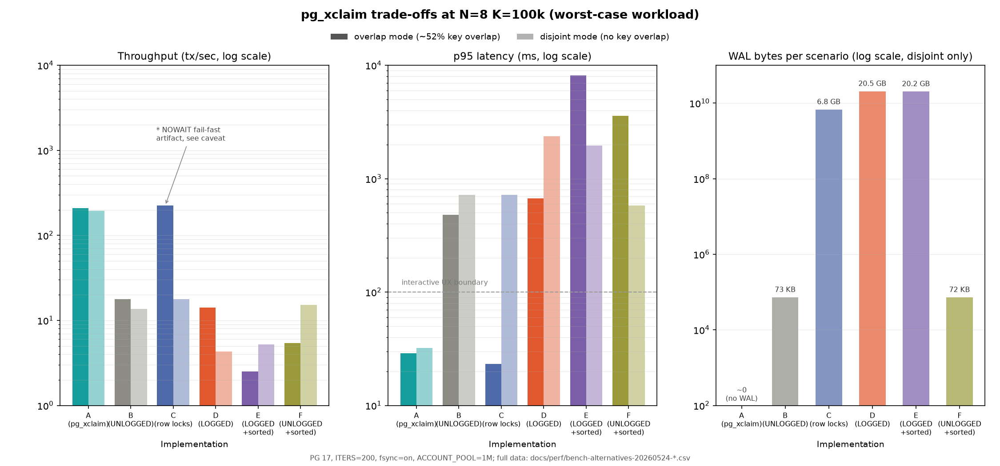
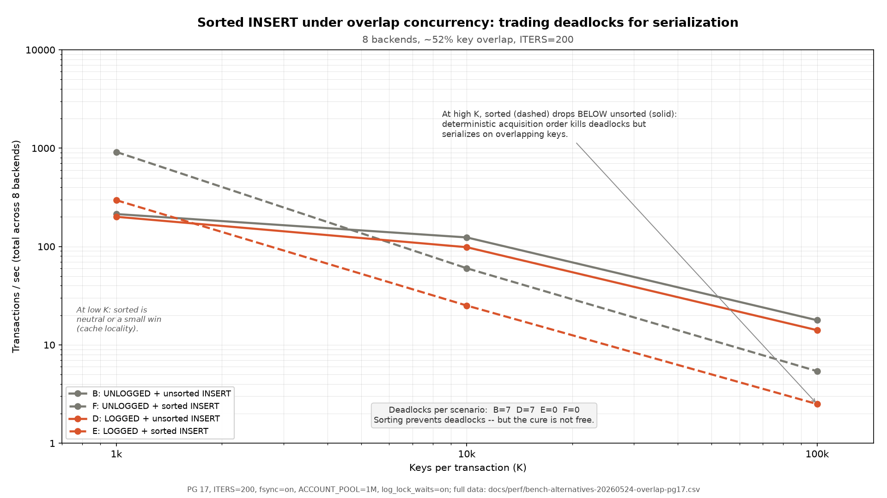

# pg_xclaim

> **English:** see [README_EN.md](README_EN.md).

[](https://github.com/Fenoman/pg_xclaim/actions/workflows/ci-pg-matrix.yml)
[](LICENSE)
[](https://github.com/Fenoman/pg_xclaim/releases)
[](https://www.postgresql.org/)
[](https://en.wikipedia.org/wiki/C_(programming_language))
[](https://github.com/Fenoman/pg_xclaim/stargazers)
[](CONTRIBUTING.md)


> ### Прежде чем рассматривать pg_xclaim — 3 правила
>
> 1. Это не универсальная замена advisory locks. Сначала поднимите
>    `max_locks_per_transaction` (4096..16384); для большинства
>    нагрузок этого достаточно.
> 2. Не используйте, если `LWLock:LockManager` не входит в топ-3
>    wait-event'ов под реальной нагрузкой на вашем проде. Это и есть узкое
>    место, под которое pg_xclaim сделан. Без него расширение даёт
>    только лишние операционные накладные расходы.
> 3. Запустите [бенчмарк альтернатив](#сравнение-с-альтернативами)
>    на зеркале своей системы. Если любая из альтернатив 1–6 быстрее
>    или сравнима по стабильности — берите её.

**Экспериментальное** PostgreSQL-расширение: альтернативный механизм
хранения транзакционных claim'ов в собственной партиционированной
shared-memory hashtable. Сделан как прототип под конкретную нагрузку:
унаследованная кодобаза с сотнями мест вызова `pg_try_advisory_xact_lock`,
операции по 100k+ claim'ов в одной транзакции, стандартные
альтернативы не подошли (см. [Альтернативы](#альтернативы)).

Это **не** замена `pg_try_advisory_xact_lock` и не позиционируется
как таковая. Сигнатуры функций намеренно совпадают, чтобы можно было точечно
мигрировать старый код в узких случаях — не как общий рецепт. Перед
использованием обязательно прочитайте [Альтернативы](#альтернативы)
и [FAQ](#faq).

> ### Прежде чем устанавливать
>
> **Операционная сложность.** Claim'ы pg_xclaim не видны в `pg_locks`,
> `pg_stat_activity`, EXPLAIN. DBA на инциденте смотрит в два места —
> стандартные инструменты PostgreSQL плюс `xclaim.stats()`. Под это
> написано отдельное руководство по инцидентам
> ([`docs/incident-decision-tree.md`](docs/incident-decision-tree.md));
> у детального `xclaim.debug_snapshot()` есть оговорка по числу партиций
> (см. [FAQ Q4](#q4-это-создаёт-операционную-сложность--теперь-смотреть-в-два-места-при-инциденте)).

---

## Зачем это нужно

Контекст. В одной конкретной системе долгоживущие транзакции
удерживают `pg_try_advisory_xact_lock` на 100k+ ключей одновременно.
На такой нагрузке `LWLock:LockManager` становится доминирующим
wait-event'ом. Не из-за `max_locks_per_transaction` (это лечится
GUC), а из-за конкуренции на partition-LWLock'ах самого LockManager.

Стандартные альтернативы (см. [Альтернативы](#альтернативы)) в
конкретной кодобазе не подошли. Слишком много мест вызова advisory,
нельзя декомпозировать транзакции, сложно менять схему.

`pg_xclaim` — эксперимент: что если положить эти claim'ы в отдельную
партиционированную shmem-структуру с теми же транзакционными
семантиками, но мимо LockManager? Получился рабочий прототип с
тестами, ранбуками и perf-бюджетами.

По стоимости: захват одного ключа — один цикл partition LWLock.
Очистка амортизированно ≤ `num_partitions` циклов на всю транзакцию
(групповая по партициям, не per-key). На горячем пути в C —
`memset` + `memcmp` на 16-байтном ключе.

Перегрузки `xclaim.try(int4, int4)` и `xclaim.try(int8)` имеют
**идентичные атрибуты функций** с `pg_try_advisory_xact_lock`
(volatility, parallel mode; strictness отличается намеренно — см.
ниже). Это нужно, чтобы можно было мигрировать старый код через
текстовую замену.



---

## Альтернативы

Прежде чем рассматривать pg_xclaim, оцените стандартные подходы.
Для ~95% нагрузок одна из строк 1–6 закрывает задачу.

| # | Решение | Когда выбирать | Компромиссы |
|---|---------|----------------|-------------|
| 1 | Поднять `max_locks_per_transaction` (4096..16384) | По умолчанию 64 не хватает; `LWLock:LockManager` НЕ топ-событие ожидания | shmem footprint небольшой (PG 16: ~100 KB на 4096×200, PG 18: ~5 MB из-за Fast-Path Array). **Главная цена — per-backend LOCALLOCK hash под high-cardinality:** ~17 MB на бэкенд при 100k удерживаемых locks. Обычно дешевле любого расширения если кардинальность транзакции невысокая. |
| 2 | Батчинг + идемпотентность через `document_id UNIQUE` | Операцию можно декомпозировать на 100–500 счетов; есть outbox/saga для атомарности | Теряется атомарность всей операции в одной транзакции; нужен идемпотентный дизайн |
| 3 | `SELECT ... FOR UPDATE NOWAIT / SKIP LOCKED` на самих счетах | Accounts — полноценные строки в таблице, доступны для row-lock; конкуренция умеренная | WAL и dead tuples на каждый залоченный tuple; взаимодействие с vacuum; partitioning по другому ключу = непредсказуемая стоимость |
| 4 | Claim-table `INSERT ... ON CONFLICT DO NOTHING RETURNING` (неблокирующий) | Простое, портируемое, инспектируемое стандартными средствами PG; кардинальность умеренная, конкурентность низкая | **Под высокой конкурентностью ловит deadlock'и** на UNIQUE-индексе (см. [бенчмарк](#сравнение-с-альтернативами): ~2.5–18 tx/sec и p95 от ~0.5 с (несортированный) до 3.5–8 с (сортированный) на 8 параллельных бэкендах в зависимости от K и варианта); требует DDL и миграции схемы; для LOGGED-таблиц — heap+index WAL и нагрузка на autovacuum |
| 5 | Шардинг на уровне приложения по `hash(account_id) % N` | Можно переделать приложение; есть N PG-подключений | Конфликтов нет по построению, но требует переделки приложения — неприменимо к старому коду |
| 6 | Оптимистическая конкурентность (`version` column + CAS) | Конфликты редкие (<5%) | Лавина повторов если конфликты частые |
| 7 | **pg_xclaim** | Альтернативы 3-4 (B/C/D) измеренно проигрывают на исходной нагрузке (см. бенчмарк); 1, 2 исключены по архитектурным причинам, специфичным для исходной системы (см. FAQ Q1, Q3); self-hosted PG; сотни мест вызова advisory в старом коде; есть ресурс на поддержку расширения | Операционная непрозрачность, managed-облака отрезаны, привязка к ABI |

Если строите новую систему — почти наверняка нужна одна из 1–6, а не
это расширение. См. также [FAQ](#faq), там разобраны частые
возражения.

---

## Build matrix

| Платформа | Версия | CI |
|-----------|--------|----|
| PostgreSQL | 16.x последний минорный | GitHub Actions |
| PostgreSQL | 17.x последний минорный | GitHub Actions (основной) |
| PostgreSQL | 18.x последний минорный | GitHub Actions |
| ABI-совместимый форк PG | 16/17/18 | локально вручную |

Флаги компиляции: `-Wall -Wextra -Werror` (HARD invariant).

---

## Установка

### Требования

- Кластер PG 16 / 17 / 18 (тестировано на upstream PG; ABI-совместимые форки могут потребовать локальной верификации).
- `pg_config` на сборочной машине.
- macOS для разработки: `brew install postgresql@17` (или 16 / 18).

### Сборка и установка

```bash
set -euo pipefail
make PG_CONFIG=/opt/homebrew/Cellar/postgresql@17/17.9/bin/pg_config
sudo make PG_CONFIG=/opt/homebrew/Cellar/postgresql@17/17.9/bin/pg_config install
```


### Конфигурация

Отредактируйте `postgresql.conf`:

```conf
# Поставьте pg_xclaim ПОСЛЕДНИМ в списке — на коммите его cleanup
# отработает раньше всех (PG вызывает xact-callback'и в LIFO-порядке).
shared_preload_libraries = 'citus,timescaledb,pg_xclaim'

pg_xclaim.max_claims                  = 4194304    # 4M (default; ~360 MB shmem)
pg_xclaim.num_partitions              = 128
pg_xclaim.expected_claims_per_backend = 16384
pg_xclaim.enabled                     = true
pg_xclaim.capacity_warn_pct           = 80
pg_xclaim.on_capacity_exhaustion      = error
```

> **Замечание о размере памяти.** `expected_claims_per_backend = 16384`
> — это размер, до которого расширение заранее наращивает
> backend-локальный `simplehash`. Если один бэкенд держит больше 16k
> одновременных claim'ов (например, цель — 750k на бэкенд), поднимите
> GUC до ожидаемого пика (~750000). Без этого тоже все будет работать, но в середине
> пиковой нагрузки бэкенд будет тратить время на rehash хеш-таблицы.
>
> Чтобы не следить за этим вручную, расширение само пишет в server log
> строку `crossed 75% of pg_xclaim.expected_claims_per_backend`, как
> только бэкенд впервые подходит к пределу. Это готовый сигнал «пора
> поднять GUC». Подробнее в `docs/runbook.md` §3.
>
> Формула общего бюджета памяти. Каждый удерживаемый claim занимает
> 48-байтную `XClaimLocalEntry`; с учётом округления simplehash до
> степени двойки и load factor ~75% эффективная стоимость — ~63 байта
> на claim при 100k, что эмпирически даёт **~50.3 MB на бэкенд при
> 750k** (см. [`docs/runbook.md` §9](docs/runbook.md#9-планирование-ёмкости)).
>
> ```
> Локальная память одного бэкенда (при 750k claim'ов) ≈ 50.3 MB
>
> Локальная память кластера (суммарно) ≈
>     ~50.3 MB × max_connections
> ```
>
> Пример. При `max_connections=200` и `expected_claims_per_backend=750000`
> это ~10 GB суммарно в TopMemoryContext'ах бэкендов
> (~50.3 MB × 200), плюс ~360 MB shmem dynahash из
> `max_claims=4194304`. Это нужно учитывать при расчёте RAM кластера:
> pre-grow per-backend — самая большая статья расхода в общем бюджете.

Перезапустите кластер, затем:

```sql
CREATE EXTENSION pg_xclaim;
```

### Ограничение для hot-standby

Расширение **не поддерживается на hot-standby репликах**. Первый же
SQL-вызов поднимает `ERRCODE_FEATURE_NOT_SUPPORTED`, если
`RecoveryInProgress()` возвращает true и `pg_xclaim` находится в
`shared_preload_libraries`. Перед продвижением standby в primary
уберите расширение из preload-списка. См.
[`docs/runbook.md`](docs/runbook.md).

---

## SQL

Все функции живут в выделенной схеме `xclaim`.

| Функция | Назначение |
|---------|------------|
| `xclaim.try(int4, int4) RETURNS boolean` | Двухаргументная функция; сигнатура совпадает с `pg_try_advisory_xact_lock(int4, int4)` для удобной миграции старого кода. |
| `xclaim.try(int8) RETURNS boolean` | Одноаргументная функция; сигнатура совпадает с `pg_try_advisory_xact_lock(bigint)`. Отдельное пространство ключей. |
| `xclaim.try_many(int4, int4[]) RETURNS boolean[]` | Пакетный вариант; пред-сортирует по партиции (≤ `num_partitions` циклов LWLock на весь массив). |
| `xclaim.try_many(int8[]) RETURNS boolean[]` | Пакетный вариант одноаргументной формы. |
| `xclaim.count() RETURNS int8` | Число claim'ов, удерживаемых текущей top-level транзакцией. |
| `xclaim.stats() RETURNS TABLE(...)` | Снимок атомарных счётчиков + метрики ёмкости. Доступ `pg_monitor`. |
| `xclaim.debug_snapshot() RETURNS TABLE(...)` | Детальный снимок shared-state под shared-lock'ами всех партиций. Доступ `pg_monitor`; требует `pg_xclaim.num_partitions <= 192`. |
| `xclaim.debug() RETURNS TABLE(...)` | Полный консистентный снимок по всем партициям. **Только superuser.** |
| `xclaim.debug_inject_stale(int4, int4) RETURNS void` | **Только для тестов.** Инъектор stale-записи (имитация владельца, не пережившего crash). **Только superuser**, `REVOKE`-нут от `PUBLIC`. В production не вызывается. |
| `xclaim.session_reset() RETURNS void` | Опциональный хук для аварийной очистки. Принудительно очищает локальное состояние и ротирует owner_token. **При штатной работе не нужен:** claim'ы освобождаются автоматически через xact-callback на каждом COMMIT/ABORT. Используется реактивно, если в проде `xclaim.stats().cleanup_misses > 0`. Не ставьте в `server_reset_query` пулера — это лишний RTT. |

### Паритет атрибутов функций с `pg_try_advisory_xact_lock`

`xclaim.try` совпадает с `pg_try_advisory_xact_lock` по volatility и
parallel-режиму; strict-режим намеренно отличается. Таблица ниже —
точное описание инварианта API, не маркетинг:

| Атрибут | `pg_try_advisory_xact_lock` | `xclaim.try` | Совпадение |
|---------|------------------------------|--------------|------------|
| `provolatile`  | `v` (VOLATILE)              | `v` (VOLATILE)              | да |
| `proparallel`  | `r` (PARALLEL RESTRICTED)   | `r` (PARALLEL RESTRICTED)   | да |
| `proisstrict`  | `t` (STRICT)                | `f` (CALLED ON NULL INPUT)  | **намеренно отличается** |

> Замечание. `pg_try_advisory_xact_lock` объявлен STRICT
> (`pg_proc.proisstrict = t`), то есть PostgreSQL молча возвращает
> NULL при любом NULL-аргументе, не вызывая C-тело. `xclaim.try`
> ведёт себя иначе: ловит NULL и явно бросает
> `ERRCODE_NULL_VALUE_NOT_ALLOWED`. Программные ошибки видны сразу,
> а не маскируются «тихим NULL».
>
> Что это значит для миграции. Вызывающий код не должен передавать
> NULL как ключ. В большинстве production-мест вызова это уже так.
> Если конкретный вызов полагался на тихий NULL-проход — добавьте
> `WHERE key IS NOT NULL` перед `xclaim.try(key)`.

### Обработка NULL

```sql
SELECT xclaim.try(NULL, 1);                  -- поднимает ERRCODE_NULL_VALUE_NOT_ALLOWED
SELECT xclaim.try(NULL);                     -- поднимает ERRCODE_NULL_VALUE_NOT_ALLOWED
SELECT xclaim.try_many(NULL::int8[]);        -- поднимает ERRCODE_NULL_VALUE_NOT_ALLOWED
SELECT xclaim.try_many(NULL, ARRAY[1]);      -- поднимает ERRCODE_NULL_VALUE_NOT_ALLOWED
SELECT xclaim.try_many(ARRAY[1, NULL, 3]);   -- поднимает ERRCODE_NULL_VALUE_NOT_ALLOWED
```

> **Обработка NULL симметрична между скалярной и пакетной формами:**
> `xclaim.try_many` поднимает ERROR на любом NULL-аргументе И на любом
> NULL-элементе внутри валидного массива, так же как и `xclaim.try`.
> Тихий NULL-возврат скрывает программные ошибки (например, массив,
> построенный из подзапроса, который выдал NULL): рекомендованный
> идиом `bool_and(unnest)` молча трактовал бы частично-NULL результат
> как успешный, потому что `bool_and` игнорирует NULL по SQL-семантике.
> Отфильтровывайте NULL-элементы через `array_remove(arr, NULL)` (или
> `WHERE x IS NOT NULL` в подзапросе) перед вызовом `xclaim.try_many`.

### Быстрый пример

```sql
BEGIN;
SELECT xclaim.try(1, 100);   -- true (claim взят)
SELECT xclaim.try(1, 100);   -- true (быстрый путь повторного входа; без LWLock)
SELECT xclaim.try(1, 100), xclaim.count();  -- (true, 1)
COMMIT;                      -- claim освобождается xact-callback'ом
```

```sql
-- Пакетный захват:
SELECT bool_and(ok)
FROM unnest(xclaim.try_many(1, ARRAY[100, 200, 300, 400])) AS ok;
```

> **Семантика результата `try_many`.** Элемент результата `i`
> соответствует входному элементу `i` (порядок сохраняется, несмотря
> на внутреннюю пере-сортировку по партиции). Это **best-effort**, не
> «всё или ничего»: при частичной неудаче захваченное подмножество
> остаётся удержанным до конца транзакции. Если нужна атомарность
> «всё или ничего», проверяйте `bool_and(...)` и делайте `ROLLBACK`,
> когда хоть один элемент вернул `false`.

### Время жизни claim'а внутри подтранзакций

Claim'ы, взятые внутри `SAVEPOINT` (или PL/pgSQL-блока
`BEGIN ... EXCEPTION`, который PostgreSQL реализует как неявный
savepoint), переживают `ROLLBACK TO SAVEPOINT` и освобождаются
**только** top-level COMMIT'ом или ABORT'ом. Это **намеренное
расхождение с `pg_try_advisory_xact_lock`**, у которого advisory-локи
освобождаются subxact-rollback'ом. Более простой контракт
"top-level lifetime" позволяет pg_xclaim'у обойтись одним xact-callback
(никакого per-subxact учёта в shared или local памяти). Если ваш
workload рассчитывает на освобождение per-savepoint — либо
реструктурируйте код, чтобы держать claim внутри той xact-границы,
которую вы хотите освободить, либо для этого конкретного call site
оставайтесь на `pg_try_advisory_xact_lock`.

---

## GUC-параметры

| GUC | Тип | По умолчанию | Описание |
|-----|-----|--------------|----------|
| `pg_xclaim.max_claims` | int4 | 4194304 | Ёмкость shared dynahash. Требует перезапуска. Footprint масштабируется линейно от `max_claims`; sizing по умолчанию — ~360 MB, удвоение `max_claims` -> удвоение footprint. |
| `pg_xclaim.num_partitions` | int4 | 128 | Количество защищённых LWLock'ом партиций. Требует перезапуска. |
| `pg_xclaim.expected_claims_per_backend` | int4 | 16384 | Заранее наращивает локальный `simplehash` до этого размера, чтобы избежать rehash'ей под нагрузкой. Требует перезапуска. |
| `pg_xclaim.enabled` | bool | true | Активный «выключатель». Off = `xclaim.try` безусловно возвращает `true`. `PGC_SUSET`. |
| `pg_xclaim.capacity_warn_pct` | int4 | 80 | Порог watermark для лога (LOG-строка на 80/90/95%). |
| `pg_xclaim.on_capacity_exhaustion` | enum | error | `error` (по умолчанию; ERRCODE 53400) / `warn` (log + return false). |

См. [`docs/runbook.md`](docs/runbook.md) — рекомендации по настройке.

---

## Использование в унаследованном коде

> Если вы только начинаете проект, не используйте pg_xclaim. Возьмите
> одну из альтернатив 1–6 из таблицы выше. Раздел ниже — для случая,
> когда уже есть сотни мест вызова `pg_try_advisory_xact_lock` в
> унаследованной кодобазе и вы прошли через все альтернативы.

> ### ⚠️ Disjoint namespace — мигрируйте все call sites атомарно
>
> `xclaim.try(k)` и `pg_try_advisory_xact_lock(k)` живут в **разных
> пространствах ключей** и **не исключают друг друга**: ключ `k`,
> взятый через advisory, и тот же `k`, взятый через xclaim, — это два
> независимых claim'а. Если часть кода уже мигрирована на `xclaim.try`,
> а часть всё ещё зовёт `pg_try_advisory_xact_lock` на тот же ключ, оба
> «успешно» захватят его одновременно — взаимное исключение сломано.
> Поэтому **все** места вызова одного keyspace должны мигрировать
> одновременно, одним изменением. Частичная миграция keyspace —
> ошибка корректности, не оптимизация.

Замените `pg_try_advisory_xact_lock(a, b)` на `xclaim.try(a, b)` и
`pg_try_advisory_xact_lock(c)` на `xclaim.try(c)` в каждом месте
вызова. Сигнатуры совпадают (volatility и parallel-mode идентичны —
см. таблицу паритета выше). Поведение на NULL отличается намеренно:
advisory молча возвращает NULL, `xclaim.try` бросает ERROR.

То есть API **совместим по сигнатуре, но не по поведению**. Для
большинства production-мест это не проблема, никто не передаёт NULL
как ключ. Но проверьте свой код перед миграцией.

---

## Структура проекта

```
pg_xclaim/
├── Makefile                                   # PGXS
├── pg_xclaim.control                          # extension metadata
├── sql/
│   └── pg_xclaim--1.0.0-rc1.sql               # install script
├── src/
│   ├── pg_xclaim.c                            # _PG_init + GUC'ы + glue
│   ├── pg_xclaim_compat.h                     # PG 16/17/18 ABI shim
│   └── ...                                    # acquire / cleanup / bulk
├── test/
│   ├── sql/, expected/                        # pg_regress
│   └── concurrency/                           # shell-driven concurrency suite
├── scripts/
│   ├── find_pg_config.sh
│   ├── run_temp_cluster.sh
│   ├── smoke_gate.sh                          # preload smoke gate
│   ├── smoke_gate_no_preload.sh               # no-preload smoke gate
│   ├── run_regress_matrix.sh
│   ├── bench_try_many.sh                      # self perf-budget gate
│   └── bench_alternatives.sh                  # comparison vs row locks / claim-table
├── docs/
│   ├── runbook.md                             # DBA-ранбук (русская)
│   ├── runbook_en.md                          # DBA runbook (English)
│   ├── incident-decision-tree.md              # дерево решений на дежурстве (русская)
│   ├── incident-decision-tree_en.md           # oncall triage (English)
│   └── perf/
│       ├── hot-path-analysis.md            # русская версия
│       ├── hot-path-analysis_en.md         # English version
│       ├── flamegraphs/                       # SVG flamegraphs
│       └── *.csv                              # bench + baseline measurements
├── .github/workflows/ci-pg-matrix.yml
└── README.md
```

---

## Производительность



Числа ниже — синтетические измерения, не универсальные утверждения о производительности. Сверяйтесь с
актуальным CSV в `docs/perf/` и измеряйте на своей нагрузке.

| Нагрузка | Наблюдается | Бюджет | Контроль |
|----------|-------------|--------|----------|
| 750k одиночный бэкенд, скалярный API | **~378 ms** end-to-end | 2000 ms | `bench_try_many.sh` |
| 750k пакетный `xclaim.try_many` | **~288 ms** | 500 ms | `bench_try_many.sh` |
| 50k acquire+COMMIT (групповая очистка) | **< 100 ms** | 100 ms | `grouped_cleanup_50k.sh` |

Числа из последнего прогона на macOS PG 17.10 / Apple M-series:
[`docs/perf/bench-20260525-pg17.csv`](docs/perf/bench-20260525-pg17.csv)
(накопительный CSV, новая строка на каждый прогон).

### Память: как считать бюджет

Сравнивать «advisory vs pg_xclaim» по памяти честно можно только при
оговорке: чтобы advisory вообще удержал 100k locks на бэкенд, нужен
`max_locks_per_transaction`, во много раз превышающий default — а это
само по себе раздувает shared lock table на весь кластер. То есть
конфигурация «до» либо нежизнеспособна, либо платит свою цену в
shmem. Поэтому здесь приводится не одно «выигрышное» число, а формула
и порядок величины — считайте под свой `max_connections` и пик claim'ов.

pg_xclaim **добавляет** фиксированный shmem-пул (`max_claims`; default
~360 MB) и per-backend локальную память:

```
shmem (общий пул)         ≈ выбранный max_claims (default 4M -> ~360 MB)
per-backend local         ≈ ~50.3 MB при 750k claim'ов
                          ≈ ~6.3 MB при 100k claim'ов
cluster-wide local        ≈ per-backend × число активных бэкендов
```

Пример (high-cardinality сценарий, под который сделано расширение):
100k claim'ов в одной транзакции × 200 параллельных бэкендов даёт
~6.3 MB × 200 ≈ ~1.26 GB локальной памяти плюс ~360 MB shmem.
Взамен снимается per-backend LOCALLOCK hash (~17 MB/бэкенд при 100k
удерживаемых advisory locks) и убирается потребность в раздутом
`max_locks_per_transaction`.

Эмпирически замерено на PG 16 и PG 18 (CPU/shmem структуры backend-local,
числа идентичны между версиями). Полная разбивка с pre-grown floor и
ростом simplehash — в [`docs/runbook.md` §9](docs/runbook.md#9-планирование-ёмкости).
Под лёгкой нагрузкой (10-100 locks на транзакцию) переход **только
добавит** ~360 MB shmem без видимой экономии — эта нагрузка изначально
не нуждается в pg_xclaim.

### Сравнение с альтернативами



Репозиторий содержит бенчмарк pg_xclaim против пяти стандартных
альтернатив, образующих полную 2×2 матрицу `{UNLOGGED, LOGGED} ×
{UNSORTED, SORTED}` для claim-table:

| | unsorted INSERT | sorted INSERT (`ORDER BY k`) |
|---|---|---|
| **UNLOGGED** | B | F |
| **LOGGED**   | D | E |

Плюс C: блокировка строк через `FOR UPDATE NOWAIT`. Бенчмарк гоняется
в двух режимах: `overlap` (общий пул ключей, ~52% попарного
пересечения на N=8 K=100k) и `disjoint` (каждому бэкенду свой шард
ключей без пересечений).

Полные числа, методология и оговорки о справедливости — в
[`docs/perf/COMPARISON.md`](docs/perf/COMPARISON.md). Сырые данные:
[`bench-alternatives-20260524-overlap-pg17.csv`](docs/perf/bench-alternatives-20260524-overlap-pg17.csv)
и [`bench-alternatives-20260524-disjoint-pg17.csv`](docs/perf/bench-alternatives-20260524-disjoint-pg17.csv).

Железо: macOS, Apple M-series, PG 17.10. Важная оговорка: macOS по
умолчанию не использует `F_FULLFSYNC`, поэтому обычный `fsync()`
возвращается до физического сброса на диск — это льстит WAL-тяжёлым
вариантам (C/D/E). На боевом Linux с честным fsync ранжирование может
быть другим; читайте числа как порядок величины, а не как точные
коэффициенты.

Краткая сводка (PG 17, ITERS=200, `fsync=on`, `log_lock_waits=on`, ACCOUNT_POOL=1M):

| Сценарий | A pg_xclaim | B UNLOGGED | C row locks | D LOGGED | E LOGGED+sorted | F UNLOGGED+sorted |
|---|---:|---:|---:|---:|---:|---:|
| N=1, K=100k overlap — tx/sec | **38** | 2.3 | 9.6 | 1.7 | 2.5 | 5.1 |
| N=1, K=100k overlap — WAL    | **0** | 723 KB | 1.2 GB | 3.6 GB | 3.4 GB | 9 KB |
| N=8, K=100k overlap — tx/sec  | **209** | 18 | 223\* | 14 | 2.5 | 5.4 |
| N=8, K=100k overlap — p95 ms  | **29** | 478 | 23 | 669 | 8124 | 3571 |
| N=8, K=100k overlap — deadlocks (per scenario, cumulative) | 0 | **7** | 0 | **7** | 0 | 0 |
| N=8, K=100k disjoint — tx/sec | **194** | 13.6 | 17.8 | 4.3 | 5.2 | 15.2 |
| N=8, K=100k disjoint — p95 ms | **32** | 719 | 721 | 2367 | 1964 | 580 |
| N=8, K=100k disjoint — WAL    | **0** | 73 KB | **6.8 GB** | **20.5 GB** | 20.2 GB | 72 KB |

> \* Видимая «победа» C на overlap — артефакт fail-fast семантики
> NOWAIT: C падает на первом конфликте за микросекунды и **не
> захватывает ни одного ключа за транзакцию**. На `disjoint`, где
> NOWAIT не может «сжульничать», тот же C даёт 18 tx/sec. Полная
> оговорка и наблюдения — в `docs/perf/COMPARISON.md`.

Deadlocks замерены напрямую: на N=8 K=100k overlap unsorted
claim-table'ы (B и D) ловят по 7 deadlock'ов за сценарий.
Sorted-варианты (E и F) дают 0 deadlock'ов. Sort
действительно их конечно же устраняет, но превращает в wait-on-lock
сериализацию (см. COMPARISON.md).

Что показывает полная матрица B/D/E/F:

- **На overlap** sort сам по себе создаёт сериализацию. F (без
  WAL) ≈ E (с WAL) при K=100k — обе на ~5 tx/sec и p95 > 3 секунд.
  То есть главная стоимость sorted-варианта это не WAL, а
  детерминированный порядок захвата под пересечением ключей.
- **На disjoint** картина переворачивается: F (15.2) > B (13.6) и
  F >> E (5.2). Без пересечений sort нейтрален или даёт небольшой
  выигрыш (вероятно cache locality в btree), а главная стоимость
  E/D — это WAL (LOGGED таблица генерирует ~20 GB WAL за прогон
  N=8 K=100k — D ~20.5 GB, E ~20.2 GB — против ~72 KB у F).

Когда pg_xclaim оправдан: K ≥ 10k и параллелизм ≥ 8 и нагрузка не
может полагаться на NOWAIT fail-fast. Иначе выбор должен делаться
по операционной простоте (B/C/D/E/F не требуют расширения и видны
в стандартных инструментах). Перед выбором запустите бенчмарк на
зеркале своей системы.

## Эксплуатационные документы

| Документ | Назначение |
|----------|------------|
| [`docs/runbook.md`](docs/runbook.md) | DBA-ранбук — установка, мониторинг, откат. |
| [`docs/incident-decision-tree.md`](docs/incident-decision-tree.md) | Дерево решений на дежурстве (P0–P3). |
| [`docs/perf/hot-path-analysis.md`](docs/perf/hot-path-analysis.md) | Профиль горячего пути с flamegraph'ами. |

---

## Ограничения

Компактный список того, чего pg_xclaim намеренно не делает. Подробности
по каждому пункту — в [`docs/runbook.md`](docs/runbook.md).

- **`PREPARE TRANSACTION` отвергается** (SQLSTATE `0A000`,
  `ERRCODE_FEATURE_NOT_SUPPORTED`). Это явное расхождение с advisory:
  advisory-локи **переживают** `PREPARE`, claim'ы pg_xclaim — нет. См.
  `docs/runbook.md`.
- **Try-only API:** нет блокирующего захвата, нет очереди ожидания, нет
  детектора deadlock'ов. Порядок захвата в retry-цикле — ответственность
  вызывающего; deadlock-детектор PostgreSQL claim'ы pg_xclaim не видит.
- **Hot-standby:** на реплике в recovery первый же вызов поднимает
  `ERRCODE_FEATURE_NOT_SUPPORTED`. Уберите из preload перед промоутом.
- **Время жизни в подтранзакциях** отличается от advisory: claim
  переживает `ROLLBACK TO SAVEPOINT`, освобождается только top-level
  COMMIT/ABORT (см. раздел выше).
- **Windows** не тестировался и не поддерживается.
- **Transaction-pooling** (pgbouncer/odyssey в режиме `transaction`):
  claim'ы привязаны к транзакции и освобождаются на её границе; не
  ставьте `session_reset` в `server_reset_query` пулера.

---

## Безопасность и multi-tenant

`pg_xclaim.max_claims` — это **один** фиксированный пул на весь кластер,
общий для всех баз данных. Дефолтные `GRANT EXECUTE ... TO PUBLIC`
зеркалят дефолты advisory и несут ту же экспозицию: любой грантополучатель
может намеренно исчерпать пул и заставить `on_capacity_exhaustion=error`
падать у других сессий. На кластерах с недоверенными ролями выполните
`REVOKE EXECUTE` (точные сигнатуры — в
[`sql/pg_xclaim--1.0.0-rc1.sql`](sql/pg_xclaim--1.0.0-rc1.sql)):

```sql
REVOKE EXECUTE ON FUNCTION xclaim.try(int8)              FROM PUBLIC;
REVOKE EXECUTE ON FUNCTION xclaim.try(int4, int4)        FROM PUBLIC;
REVOKE EXECUTE ON FUNCTION xclaim.try_many(int8[])       FROM PUBLIC;
REVOKE EXECUTE ON FUNCTION xclaim.try_many(int4, int4[]) FROM PUBLIC;
```

Полная модель угроз и порядок раскрытия уязвимостей —
[`.github/SECURITY.md`](.github/SECURITY.md).

---

## FAQ

Вопросы, которые задаст любой вдумчивый PG-инженер.

### Q1: «Почему не поднять `max_locks_per_transaction` до 8192?»

В большинстве случаев это правильное решение, рекомендуется первым
(см. строку 1 в [Альтернативы](#альтернативы)).

В исходном сценарии оно не сработало по одной причине: под высокой
конкурентностью partition-LWLock'и самого LockManager сами становятся
горячей точкой среди wait-event'ов. Поднять `max_locks_per_transaction`
это не выход, конкуренция остаётся.

Если у вас обычное исчерпание `max_locks_per_transaction` и
`LWLock:LockManager` не в топе wait-events — поднимите GUC и не
ставьте pg_xclaim. Это дешевле и проще.

### Q2: «Почему не `SELECT ... FOR UPDATE NOWAIT` на самих счетах?»

Для новых систем — часто правильный выбор. В исходной системе
`accounts` — интенсивно обновляемая таблица с десятками столбцов,
partitioning по другому ключу. FOR UPDATE на тысячах строк создаёт
значительный WAL и dead tuples, а row-level блокировки на тысячах
счетов задевают десятки партиций с непредсказуемой стоимостью. См.
[Сравнение с альтернативами](#сравнение-с-альтернативами) для измеренных цифр.

### Q3: «Почему не `INSERT INTO claim_table ... ON CONFLICT DO NOTHING`?»



Семантически вариант работает, мы его проверили. Основная проблема
под нагрузкой: на UNIQUE-индексе возникают deadlock'и (см.
[Сравнение с альтернативами](#сравнение-с-альтернативами)).

Конкретные цифры на 8 параллельных бэкендах с пересекающимися
ключами (overlap, K=100k) — это разные точки, не один диапазон:
- B (UNLOGGED): 17.8 tx/sec, p95 478 мс, 7 deadlock'ов за сценарий;
- D (LOGGED): 14.1 tx/sec, p95 669 мс, 7 deadlock'ов;
- E (LOGGED+sorted): 2.5 tx/sec, p95 8124 мс, 0 deadlock'ов;
- F (UNLOGGED+sorted): 5.4 tx/sec, p95 3571 мс, 0 deadlock'ов;
- pg_xclaim в той же конфигурации: 209 tx/sec, p95 29 мс.

Точные числа зависят от K и от того, отсортирован ли batch (см.
таблицы в [Сравнении](#сравнение-с-альтернативами)). Сгладить можно
через `lock_timeout` + повторы в приложении, но это лишняя сложность.

Мы гоняли бенчмарк в трёх вариантах claim-table:

- B (UNLOGGED) — честное сравнение в памяти с xclaim;
- D (LOGGED) — ближе к production;
- E (LOGGED + ORDER BY) — production-приём против deadlock'ов.

LOGGED-варианты дополнительно создают heap+index WAL: ~18 MB WAL на
100k-claim транзакцию (~3.6 GB на сценарии из 200 транзакций; у
pg_xclaim 0). Это напрямую давит на лаг репликации и autovacuum.
Deadlock'и на UNIQUE-индексе при пересечении ключей возникают у
unsorted-вариантов (B/D по 7 за сценарий); sorted-варианты (E/F)
устраняют их за счёт wait-on-lock сериализации. В E под overlap эта
сериализация оказалась ещё хуже несортированного варианта.

Ещё claim-table требует DDL: отдельная таблица, миграция, привязка к
схеме приложения. Главный аргумент в исходном сценарии — миграция
без DDL и сотни мест вызова старого advisory-кода: замена через
`sed` `pg_try_advisory_xact_lock` → `xclaim.try` без правки схемы.

Если у вас новый проект с низкой кардинальностью и умеренной
конкурентностью — claim-table проще и понятнее.

### Q4: «Это создаёт операционную сложность — теперь смотреть в два места при инциденте.»

Да, это реальный недостаток, и в проекте он открыто признаётся.
`pg_locks` не покажет xclaim'ы; базовая видимость идёт через
`xclaim.stats()`, а детальный `SELECT * FROM xclaim.debug_snapshot()`
работает только при `pg_xclaim.num_partitions <= 192`. Документы
[`docs/runbook.md`](docs/runbook.md) и
[`docs/incident-decision-tree.md`](docs/incident-decision-tree.md)
существуют именно потому, что новый примитив с состоянием = новое
руководство по инцидентам. Если у вас нет ресурса на обучение
DBA-команды дополнительному инструменту — не используйте pg_xclaim.

### Q5: «Будет ли это поддерживаться через 2 года, на PG 19/20?»

Не гарантируется. Каждый major-релиз PG требует патчей совместимости
(PG 16->17->18 уже обкатаны).

Upstream PG движется в сторону меньшей конкуренции на LockManager.
Например, в PG 18 Tomas Vondra расширил fast-path locking
([release notes](https://www.postgresql.org/docs/release/18.0/),
[коммит `c4d5cb71d22`](https://git.postgresql.org/gitweb/?p=postgresql.git;a=commit;h=c4d5cb71d229095a39fda1121a75ee40e6069a2a)),
сняв узкое место `LWLock:LockManager` для query-heavy нагрузок с
большим числом relation-locks.

Этот механизм не переносится на advisory locks. Fast-path требует
доминирования слабых режимов (`mode < ShareUpdateExclusiveLock` в
`EligibleForRelationFastPath`), а advisory locks эксклюзивны по
дизайну: взаимное исключение это их основная семантика.

Другие пути уменьшения конкуренции на LockManager существуют:
увеличение `NUM_LOCK_PARTITIONS`, отдельный пул для advisory. Если
upstream сделает такой шаг — ниша pg_xclaim сожмётся.

### Q6: «Где это уместно использовать?»

Очень узкий сегмент:

1. Self-hosted PG (managed-облака отпадают по `shared_preload_libraries`).
2. Измеренный `LWLock:LockManager` как топовый wait-event под
   реалистичной нагрузкой.
3. Нагрузка удерживает 100k+ claim'ов в одной транзакции.
4. Альтернативы 3-4 исключены по измеренным причинам (бенчмарк);
   1, 2 — по архитектурным причинам, специфичным для системы
   (не «показалось»).
5. У команды есть ресурс на поддержку расширения и обучение DBA.

Если хотя бы один из пунктов (1)–(5) не выполнен — берите
альтернативы.

### Q7: «Это как-то связано с Redis XCLAIM?»

Нет. Никакого отношения к Redis-команде `XCLAIM`. Имя расшифровывается
как **transactional (xact) claims** — claim'ы, привязанные к жизненному
циклу транзакции PostgreSQL. Схема `xclaim` фиксированная
(`relocatable = false`) и не может быть переименована при
`CREATE EXTENSION` — проверьте, что имя `xclaim` не занято в вашей базе,
до установки.

---

## Лицензия

[PostgreSQL License](LICENSE) — те же либеральные условия, что у самой
PostgreSQL. Copyright (c) 2026, E. Pavlichenko.

---

## Статус

**v1.0.0-rc1** — первый публичный кандидат в релиз экспериментального
прототипа. Документация и тесты на месте, матрица сборки зелёная на
PG 16/17/18, код покрыт трёхуровневым набором тестов и контролируется
бюджетами производительности.

Почему `1.0.0-rc1`, а не `0.x`, при статусе «экспериментальный»: публичный
SQL-API заморожен (сигнатуры функций, имена GUC, схема), и расширение
проходит полную тестовую матрицу на PG 16/17/18. «Экспериментальность»
относится к узости ниши и операционной зрелости, а не к нестабильности
API. История изменений — в [`CHANGELOG.md`](CHANGELOG.md).