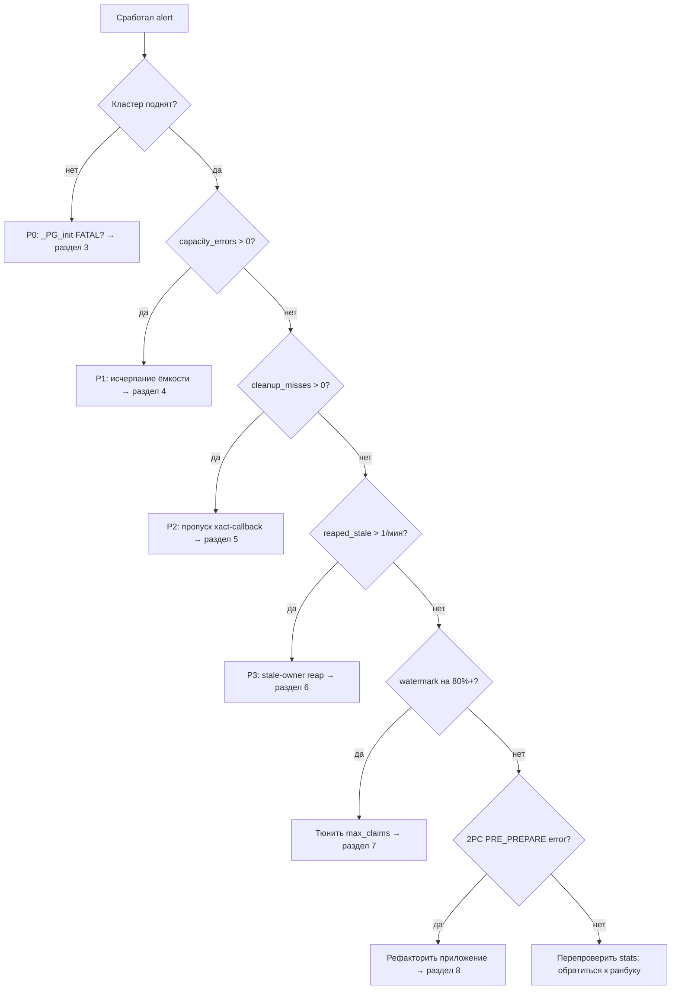
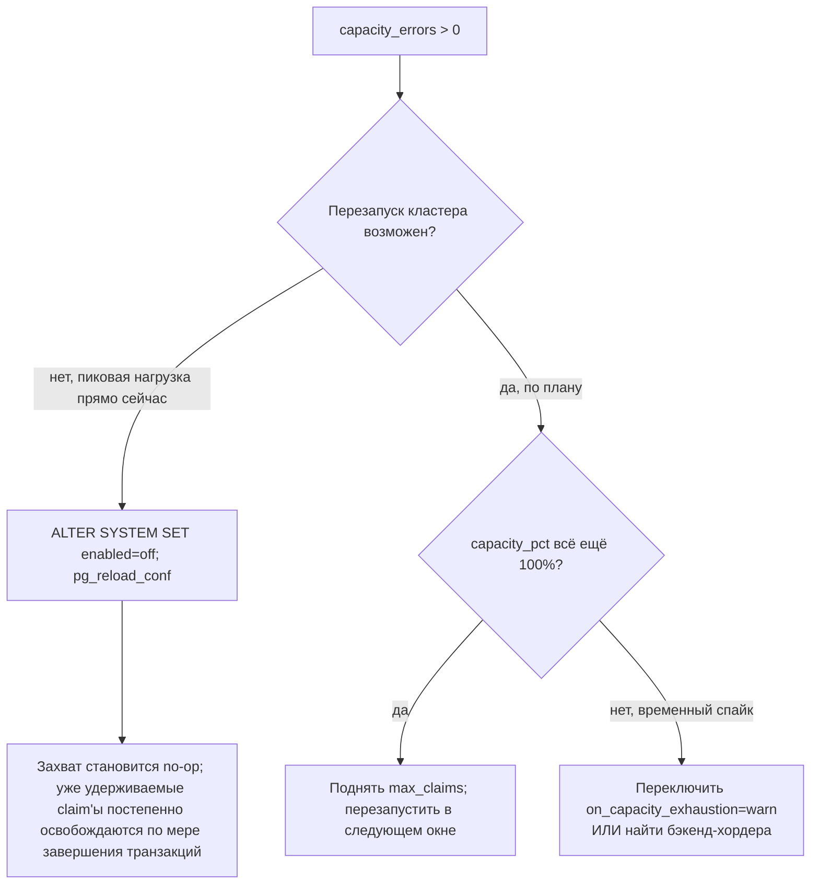

# pg_xclaim — дерево решений на инциденте

> **English version:** [`incident-decision-tree_en.md`](incident-decision-tree_en.md).

> Соглашение: каждая команда подразумевает `set -euo pipefail`, если
> используется в скриптах.

---

## Оглавление

1. [Матрица серьёзности](#1-матрица-серьёзности)
2. [Дерево решений (обзор)](#2-дерево-решений-обзор)
3. [P0 — кластер не запускается (`_PG_init` FATAL)](#3-p0--кластер-не-запускается-_pg_init-fatal)
4. [P1 — исчерпание ёмкости (`capacity_errors > 0`)](#4-p1--исчерпание-ёмкости-capacity_errors--0)
5. [P2 — пропуск xact-callback'а (`cleanup_misses > 0`)](#5-p2--пропуск-xact-callbackа-cleanup_misses--0)
6. [P3 — рост частоты `reaped_stale`](#6-p3--рост-частоты-reaped_stale)
7. [Watermark на 80/90/95%](#7-watermark-на-809095)
7a. [Лог `crossed 75% of expected_claims_per_backend`](#7a-лог-строка-crossed-75-of-expected_claims_per_backend)
8. [2PC `PRE_PREPARE` reject](#8-2pc-pre_prepare-reject)
9. [Восстановление (после инцидента)](#9-восстановление-после-инцидента)

---

## 1. Матрица серьёзности

| Severity | Триггер | Первое действие |
|----------|---------|-----------------|
| P0 | `_PG_init` FATAL после деплоя → кластер лежит | Откатить preload на затронутом узле; перезапустить. |
| P1 | `capacity_errors` растёт (любой прирост) | Отключить pg_xclaim через `enabled=off` или поднять `max_claims` в следующем окне планового обслуживания. |
| P2 | `cleanup_misses` растёт (любой прирост) | Расследовать пропуск xact-callback'а. |
| P3 | `reaped_stale` растёт быстрее 1/мин | Расследовать `session_reset`, `cleanup_misses`, частоту пересоздания бэкендов. |

---

## 2. Дерево решений (обзор)



---

## 3. P0 — кластер не запускается (`_PG_init` FATAL)

### Симптом

Кластер не стартует. `pg_ctl start` возвращает ненулевой код. Лог
сервера содержит одно из:

```
FATAL:  pg_xclaim compiled against PG 1700 but running on PG 1600 -- refusing load
FATAL:  pg_xclaim.expected_claims_per_backend (N) must be <= pg_xclaim.max_claims (M)
```

Для второго варианта (нарушен GUC-инвариант) восстановление —
понизить `pg_xclaim.expected_claims_per_backend` ≤
`pg_xclaim.max_claims` и стартовать заново; см. `docs/runbook.md`
§10.6.

> **Замечание: hot-standby — это НЕ проблема.** Hot-standby (или primary,
> ещё проигрывающий WAL) preload'ит pg_xclaim чисто. SQL-вызовы
> (`xclaim.try`, `xclaim.try_many`, и пр.) возвращают
> `ERRCODE_FEATURE_NOT_SUPPORTED` с сообщением
> `pg_xclaim does not support hot-standby/recovery mode` (подсказка:
> `Remove from shared_preload_libraries on standby clusters`), пока
> узел в recovery — проверка срабатывает в момент вызова, а не на
> preload. Промоушн до primary заставляет вызовы успешно отрабатывать
> без restart'а или правки конфига, как только
> `pg_is_in_recovery() = false`.
>
> Серверный HINT предлагает убрать расширение из
> `shared_preload_libraries` на standby; это необязательно — preload
> на standby безопасен, вызовы просто корректно завершаются ошибкой до
> промоушна.

### Расследование

1. Проверить `postgresql.conf` — действительно ли `pg_xclaim` есть в
   `shared_preload_libraries`?
2. Проверить мажорную версию запущенного PG-бинарника:
   `pg_config --version`.
3. Это узел hot-standby, который только что был промоутнут?
   `select pg_is_in_recovery();` (если можете подключиться через
   временный fallback-конфиг).
4. `ls -la /path/to/pg_xclaim.so` — существует ли `.so`? Размер
   правдоподобен (несколько сотен KB)?

### Что делать сейчас

1. Отредактировать `postgresql.conf` на затронутом узле:
   ```conf
   # shared_preload_libraries = 'citus,timescaledb,pg_xclaim'   <-- закомментировать
   shared_preload_libraries = 'citus,timescaledb'
   ```
2. Перезапустить:
   ```bash
   set -euo pipefail
   pg_ctl restart -D "$PGDATA" -m fast
   ```
3. Убедиться, что кластер поднялся: `psql -c "SELECT 1"`.

### Действия после инцидента

- Восстановите чистое состояние: пересоберите и переустановите
  предыдущий проверенный `pg_xclaim.so`. Если такого
  билда у вас нет — пока удалите бинарь полностью, до исправленного
  билда. Перезапустите кластер.

---

## 4. P1 — исчерпание ёмкости (`capacity_errors > 0`)

### Симптом

Запросы приложения падают с:

```
ERROR:  pg_xclaim: max_claims (4194304) exhausted
HINT:   Increase pg_xclaim.max_claims and restart, or set
        pg_xclaim.on_capacity_exhaustion to warn.
SQLSTATE: 53400
```

`xclaim.stats().capacity_errors` инкрементируется в мониторинге
(счётчик растёт прямо сейчас).

### Расследование

```sql
SELECT * FROM xclaim.stats();
```

Смотрите на:
- `capacity_pct` близко к 100;
- `capacity_used` близко к `capacity_max`;
- `peak_per_backend` — один бэкенд держит большую часть ёмкости?

```sql
-- Разбивка по базам / по бэкендам
SELECT database_oid, owner_pid, count(*)
FROM xclaim.debug_snapshot()
GROUP BY 1, 2
ORDER BY 3 DESC
LIMIT 20;
```

`xclaim.debug_snapshot()` удерживает shared-lock'и всех партиций и
доступен только при `pg_xclaim.num_partitions <= 192`; при большем
числе партиций используйте `xclaim.stats()` и server log.

### Что делать — ветви решения



### Конкретные команды

**Вариант A — soft kill (без перезапуска):**
```sql
ALTER SYSTEM SET pg_xclaim.enabled = off;
SELECT pg_reload_conf();
```

**Вариант B — обрабатывать исчерпание как конфликт (без перезапуска):**
```sql
ALTER SYSTEM SET pg_xclaim.on_capacity_exhaustion = warn;
SELECT pg_reload_conf();
-- Захват возвращает false на исчерпании (срабатывает retry path
-- вызывающего); WARNING-строка на каждое событие. Отслеживать
-- capacity_warnings в stats.
```

**Вариант C — поднять ёмкость (в следующем окне планового обслуживания):**
```conf
# postgresql.conf
pg_xclaim.max_claims = 8388608   # 8M (было 4M); ~720MB shmem
```
Затем `pg_ctl restart -D "$PGDATA" -m fast`.

### Действия после инцидента

- Пересмотреть `expected_claims_per_backend`, если один бэкенд
  устойчиво держал > 100k claim'ов.

---

## 5. P2 — пропуск xact-callback'а (`cleanup_misses > 0`)

### Симптом

`xclaim.stats().cleanup_misses` растёт прямо сейчас (счётчик
инкрементируется). Это происходит, когда xact-callback пропущен, а
fallback `before_shmem_exit` подобрал оставшиеся записи.

### Расследование

1. Проверьте лог сервера около времени инкремента. Ищите
   несвязанные PG-ошибки: panic, signal handling, FATAL во время
   xact end и т. д.
2. Проверьте `pg_stat_database.xact_rollback` — растёт ли доля
   rollback'ов?
3. Убедитесь, что цепочка xact-callback'ов не прерывается
   callback'ом другого расширения, который поднимает ERROR до того,
   как очередь дойдёт до pg_xclaim.

> Порядок callback'ов на коммите — LIFO: последний зарегистрированный
> отрабатывает первым. Если `pg_xclaim` не последний в
> `shared_preload_libraries`, callback стороннего расширения
> срабатывает раньше и может бросить ERROR до того, как cleanup
> pg_xclaim успеет отработать — это и инкрементирует
> `cleanup_misses`. Проверьте `SHOW shared_preload_libraries;`. Полное
> объяснение с ссылками на исходники PG — в `docs/runbook.md` §2.

### Что делать

`session_reset()` — реактивный инструмент аварийного восстановления
состояния для этого сценария. Его не следует прописывать в
`server_reset_query` пулера для штатного возврата бэкенда в пул (см.
ранбук).

Важная оговорка: `xclaim.session_reset()` — backend-local, она
работает только в сессии вызова и не может «дотянуться» до чужого
backend. Чтобы реально очистить state в подозрительных backends,
есть два пути:

```sql
-- Targeted: убить подозрительный backend по pid (его cleanup
-- отработает через before_shmem_exit, пулер создаст новый чистый).
SELECT pg_terminate_backend(<pid из pg_stat_activity>);

-- Wide: ротировать весь пул соединений — все physical backends
-- умирают и создаются заново. Команда зависит от пулера:
--   pgbouncer:    pgbouncer -R  (или RECONNECT через admin console)
--   pg_doorman:   reload
--   odyssey:      SIGHUP
```

`xclaim.session_reset()` SQL-вызов остаётся полезным в собственной
admin-сессии, если она долгоживущая и сама накопила state:

```sql
-- Cleanup своей admin-сессии (не воздействует на чужие backends).
SELECT xclaim.session_reset();
```

Если скорость устойчиво > 1/мин:
1. Включите мягкий аварийный выключатель:
   `ALTER SYSTEM SET pg_xclaim.enabled = off;`
2. Примените откатный DDL по местам вызова (Level 2 rollback по
   ранбуку).

---

## 6. P3 — рост частоты `reaped_stale`

### Симптом

`xclaim.stats().reaped_stale` растёт быстрее одного инкремента в
минуту, и так не разово, а устойчиво.

### Расследование

```sql
SELECT * FROM xclaim.stats();
```

Параллельно смотрите server log вокруг времени прироста:
`cleanup_misses`, вызовы `xclaim.session_reset()`, быстрый recycle
соединений пулером.

### Что делать

Сам по себе lazy-reaper, который подбирает устаревшие записи на
очередном конфликте, — это штатное самовосстановление. Чинить его не
нужно.

Что значит этот алерт. У каждой записи в shared memory есть «паспорт
владельца»: три поля — `procno` (слот бэкенда), `lxid` (transaction
id на момент захвата) и `token` (per-backend счётчик-поколение).
Алерт срабатывает, когда есть записи, у которых паспорт уже ни с
кем не совпадает: бэкенд погиб, поменял token или вызвал
session_reset, а запись в shared memory осталась.

Обычный hard kill backend'а (`SIGKILL`, segfault, OOM kill) такие
бесхозные записи **не оставляет**. PostgreSQL обрабатывает это как
child crash с полным пересозданием shared memory
(`REL_18_STABLE:postmaster.c:2768-2792,3180-3202`). Поэтому алерт
говорит о чём-то другом: bug в callback chain, race в session_reset,
или подобный сценарий уровнем выше.

Действовать надо не на самом reaper'е, а уровнем выше:

| Причина | Решение |
|---------|---------|
| Частые `xclaim.session_reset()` | Каждый вызов ротирует owner_token и оставляет старые shared-rows бесхозными — их подбирает reaper, увеличивая счётчик. Найти кто вызывает функцию (приложение / `server_reset_query` пулера / monitoring) и убрать из routine pathway. |
| Одновременно растёт `cleanup_misses` | Расследовать callback skip; собрать логи around xact end. |
| Быстрый recycle соединений пулером | Снизить частоту пересоздания соединений; проверить пути аварийного disconnect. |

### Действия после инцидента

- Если `reaped_stale` остаётся высоким, но ни одна из причин выше
  не подтвердилась, заведите issue. Скорее всего lazy-reaper не
  успевает за нагрузкой; потребуется отдельный фоновый reaper.

---

## 7. Watermark на 80/90/95%

### Симптом (лог сервера)

```
LOG:  pg_xclaim: capacity watermark crossed -- 81% (3404288 / 4194304 claims)
```

Эмитится, когда `capacity_pct` впервые пересекает один из {80, 90, 95}.
Пороги 80% и 90% пишутся на уровне `LOG`, порог 95% эскалируется до
`WARNING`. Нижний порог контролируется GUC `pg_xclaim.capacity_warn_pct`
(default 80); жёстко заданные пороги строго ниже настроенного
`capacity_warn_pct` не эмитятся вовсе. Процент в строке целочисленный.
Дальнейшие предупреждения подавлены на 60 секунд.

### Действие

| Порог | Severity | Действие |
|-------|----------|----------|
| 80% | warn | Запланировать поднятие `max_claims` в следующем окне планового обслуживания. |
| 90% | page | Поднять дежурного; рассмотреть переключение в режим `warn` (исчерпание = конфликт). |
| 95% | page | Отключить pg_xclaim и поднять `max_claims`. |

```sql
-- Посмотреть, кто заполняет ёмкость:
SELECT database_oid, count(*) AS claims_held
FROM xclaim.debug_snapshot()
GROUP BY 1
ORDER BY 2 DESC;
```

`xclaim.debug_snapshot()` требует `pg_xclaim.num_partitions <= 192`.

---

## 7a. Лог-строка «crossed 75% of expected_claims_per_backend»

### Симптом (лог сервера)

```
LOG:  pg_xclaim: per-backend live claims (12345) crossed 75% of
      pg_xclaim.expected_claims_per_backend (16384) -- simplehash
      will rehash on further growth
HINT:  Raise pg_xclaim.expected_claims_per_backend to your observed
       peak and restart the cluster.
```

### Что это значит

Один из бэкендов впервые в этой сессии накопил 75% от
`expected_claims_per_backend`. Это ранний предупредительный сигнал,
он срабатывает заметно раньше любого роста хэша: сам rehash происходит,
когда заполнение массива бакетов `simplehash` достигает 0.9
(fillfactor). 75% даёт запас, чтобы поднять GUC до того, как rehash
случится на горячем пути захвата.

Это не ошибка и не причина для page'а. Расширение продолжает
работать корректно, просто платит rehash-латентность на следующих
acquire'ах. Сообщение эмитится один раз на сессию (повторно — после
`xclaim.session_reset()`, если бэкенд снова дойдёт до порога).

### Что делать

1. Найти фактический peak: `SELECT peak_per_backend FROM xclaim.stats();`
2. Поднять GUC до peak с запасом ×1.2–×1.5:
   ```conf
   pg_xclaim.expected_claims_per_backend = 32768   # пример: peak ~22k
   ```
3. Перезапустить кластер (PGC_POSTMASTER).

---

## 8. 2PC `PRE_PREPARE` reject

### Симптом

```
ERROR:  pg_xclaim: PREPARE TRANSACTION is not allowed while pg_xclaim claims are held
HINT:   Release pg_xclaim claims (or COMMIT/ROLLBACK the transaction) before preparing.
SQLSTATE: 0A000  -- feature_not_supported
```

### Причина

pg_xclaim явно отказывает в передаче 2PC на `XACT_EVENT_PRE_PREPARE`.

Это жёсткое ограничение расширения. Собственные advisory locks
PostgreSQL ведут себя иначе: они сохраняются через `PREPARE
TRANSACTION` через `AtPrepare_Locks()` (см. PG18 `lock.c:3446`,
PG17 `lock.c:3304`, PG16 `lock.c:3299`), а последующий
`COMMIT/ROLLBACK PREPARED` их освобождает.

pg_xclaim не реализует такую поддержку, потому что в PostgreSQL нет
публичного API, через который расширение могло бы стать участником
2PC. Внутренний API `RegisterTwoPhaseRecord` использует фиксированный
`TwoPhaseRmgrId` (typedef `uint8` в `twophase_rmgr.h`), а ID
resource-manager'ов — закрытый набор встроенных `#define`-констант (с
потолком `TWOPHASE_RM_MAX_ID`), который расширения не могут расширить.
Поддержка 2PC требует апстрим-патча в PostgreSQL.

### Что делать

DBA-сторонней правки здесь нет. Три варианта на стороне приложения:

1. Вынести шаг захвата за пределы prepared-транзакции.
2. Использовать `pg_try_advisory_xact_lock` напрямую на этом пути.
3. Перестроить workflow так, чтобы 2PC вообще не требовался.

---

## 9. Восстановление (после инцидента)

После любого инцидента P0/P1/P2:

1. Подтвердить, что `xclaim.stats()` чистая:
   ```sql
   SELECT * FROM xclaim.stats();
   -- ожидается: capacity_errors = 0
   --            cleanup_misses  = 0
   --            скорость reaped_stale стабильная
   ```
2. Включить захват обратно, если был отключён:
   ```sql
   ALTER SYSTEM SET pg_xclaim.enabled = on;
   SELECT pg_reload_conf();
   ```
3. Убедиться, что распределение wait-event'ов вернулось к baseline:
   ```sql
   SELECT wait_event_type, wait_event, count(*)
   FROM pg_stat_activity
   WHERE state IS NOT NULL
   GROUP BY 1, 2
   ORDER BY 3 DESC;
   ```
