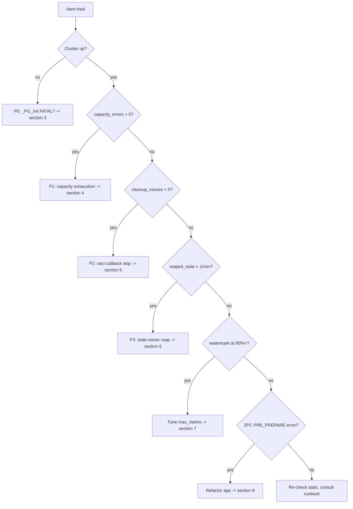
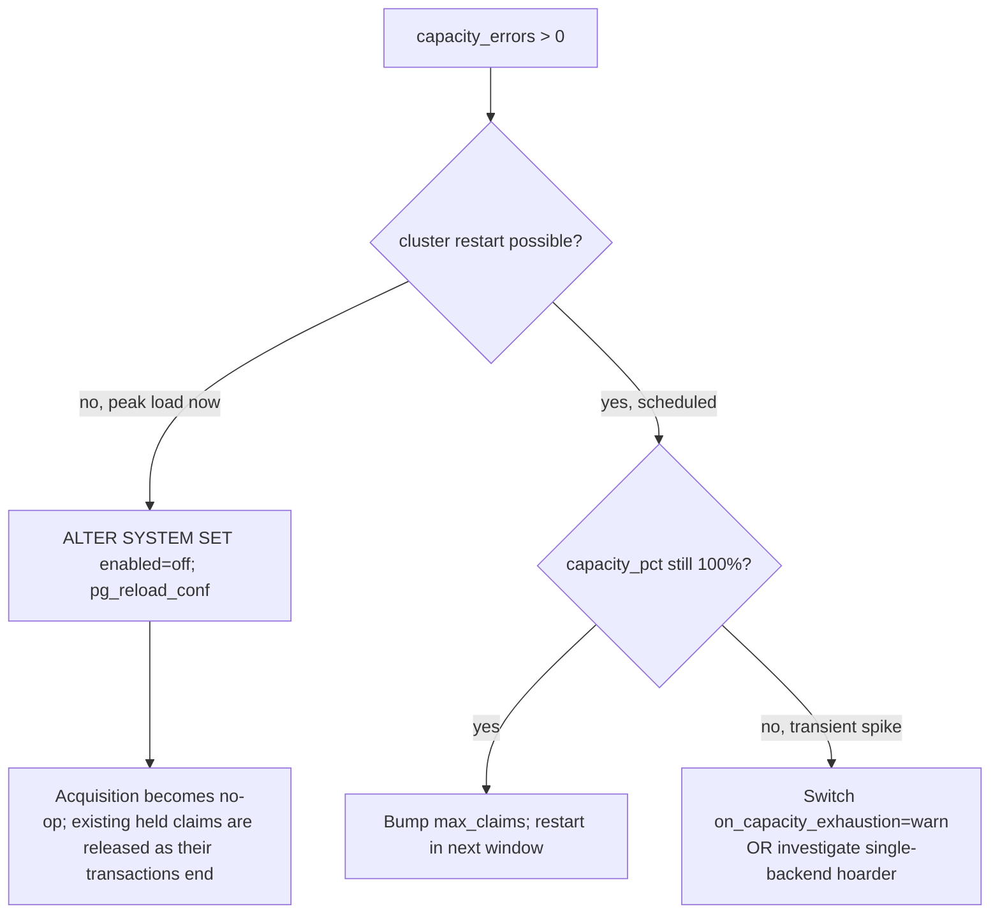

# pg_xclaim Incident Decision Tree

> **Русская версия:** [`incident-decision-tree.md`](incident-decision-tree.md).

> Convention: every command assumes `set -euo pipefail` if used in scripts.

---

## Table of Contents

1. [Severity matrix](#1-severity-matrix)
2. [Decision tree (overview)](#2-decision-tree-overview)
3. [P0 — cluster down (`_PG_init` FATAL)](#3-p0--cluster-down-_pg_init-fatal)
4. [P1 — capacity exhaustion (`capacity_errors > 0`)](#4-p1--capacity-exhaustion-capacity_errors--0)
5. [P2 — xact callback skip (`cleanup_misses > 0`)](#5-p2--xact-callback-skip-cleanup_misses--0)
6. [P3 — reaped-stale rate climbing](#6-p3--reaped-stale-rate-climbing)
7. [Watermark at 80/90/95%](#7-watermark-at-809095)
7a. [Log `crossed 75% of expected_claims_per_backend`](#7a-log-line-crossed-75-of-expected_claims_per_backend)
8. [2PC `PRE_PREPARE` reject](#8-2pc-pre_prepare-reject)
9. [Recovery (post-incident)](#9-recovery-post-incident)

---

## 1. Severity matrix

| Severity | Trigger                                       | First action |
|----------|-----------------------------------------------|--------------|
| P0       | `_PG_init` FATAL post-deploy -> cluster down  | Revert preload on the affected node; restart. |
| P1       | `capacity_errors` rate > 0                    | Turn off pg_xclaim, or raise `max_claims` in the next window. |
| P2       | `cleanup_misses` rate > 0                     | Investigate xact callback skip. |
| P3       | `reaped_stale` rate > 1/min                   | Investigate `session_reset`, `cleanup_misses`, backend churn. |

---

## 2. Decision tree (overview)



---

## 3. P0 — cluster down (`_PG_init` FATAL)

### Symptom

Cluster fails to start. `pg_ctl start` returns non-zero. Server log
contains one of:

```
FATAL:  pg_xclaim compiled against PG 1700 but running on PG 1600 -- refusing load
FATAL:  pg_xclaim.expected_claims_per_backend (N) must be <= pg_xclaim.max_claims (M)
```

For the second variant (GUC invariant violated) the recovery is to
lower `pg_xclaim.expected_claims_per_backend` ≤
`pg_xclaim.max_claims` and start the cluster again; see
`docs/runbook_en.md` §10.6.

> **Note: hot-standby is NOT a problem.** A hot standby (or a primary still
> in WAL replay) preloads pg_xclaim cleanly. SQL calls
> (`xclaim.try`, `xclaim.try_many`, etc.) return
> `ERRCODE_FEATURE_NOT_SUPPORTED` with the message
> `pg_xclaim does not support hot-standby/recovery mode` (hint:
> `Remove from shared_preload_libraries on standby clusters`) while the
> node is in recovery -- the check fires at SQL call time, not at
> preload. Promotion to primary makes the calls succeed without any
> restart or config change once `pg_is_in_recovery() = false`.
>
> The server-side HINT suggests removing the extension from
> `shared_preload_libraries` on standbys; this is optional -- preload
> on a standby is safe, the calls simply error out cleanly until
> promotion.

### Investigation

1. Check `postgresql.conf` -- is `pg_xclaim` actually in
   `shared_preload_libraries`?
2. Check the running PG binary major version: `pg_config --version`.
3. Is this node a hot standby that just got promoted? `select pg_is_in_recovery();`
   (if you can connect via a fallback config).
4. `ls -la /path/to/pg_xclaim.so` -- does the `.so` exist? Is its size
   plausible (~few hundred KB)?

### Mitigation (immediate)

1. Edit `postgresql.conf` on the affected node:
   ```conf
   # shared_preload_libraries = 'citus,timescaledb,pg_xclaim'   <-- comment out
   shared_preload_libraries = 'citus,timescaledb'
   ```
2. Restart:
   ```bash
   set -euo pipefail
   pg_ctl restart -D "$PGDATA" -m fast
   ```
3. Verify cluster is up: `psql -c "SELECT 1"`.

### Post-mortem actions

- Restore a clean state: rebuild and reinstall the previous
  known-good `pg_xclaim.so`. If you do not have one yet, remove the
  binary entirely until a corrected build is available. Restart the
  cluster.

---

## 4. P1 — capacity exhaustion (`capacity_errors > 0`)

### Symptom

Application queries fail with:

```
ERROR:  pg_xclaim: max_claims (4194304) exhausted
HINT:   Increase pg_xclaim.max_claims and restart, or set
        pg_xclaim.on_capacity_exhaustion to warn.
SQLSTATE: 53400
```

`xclaim.stats().capacity_errors` rate > 0 in monitoring.

### Investigation

```sql
SELECT * FROM xclaim.stats();
```

Look for:
- `capacity_pct` close to 100;
- `capacity_used` close to `capacity_max`;
- `peak_per_backend` — is one backend holding most of the capacity?

```sql
-- Per-database / per-backend breakdown
SELECT database_oid, owner_pid, count(*)
FROM xclaim.debug_snapshot()
GROUP BY 1, 2
ORDER BY 3 DESC
LIMIT 20;
```

`xclaim.debug_snapshot()` holds shared locks on all partitions and is
available only when `pg_xclaim.num_partitions <= 192`; at higher
partition counts use `xclaim.stats()` and the server log.

### Mitigation -- decision branches



### Concrete commands

**Option A -- soft kill (no restart):**
```sql
ALTER SYSTEM SET pg_xclaim.enabled = off;
SELECT pg_reload_conf();
```

**Option B -- treat exhaustion as conflict (no restart):**
```sql
ALTER SYSTEM SET pg_xclaim.on_capacity_exhaustion = warn;
SELECT pg_reload_conf();
-- Acquisition returns false on exhaustion (caller's retry path
-- triggers); WARNING line per event. Track capacity_warnings in stats.
```

**Option C -- raise capacity (next maintenance window):**
```conf
# postgresql.conf
pg_xclaim.max_claims = 8388608   # 8M (was 4M); ~720MB shmem
```
Then `pg_ctl restart -D "$PGDATA" -m fast`.

### Post-mortem actions

- Re-baseline `expected_claims_per_backend` if a single backend held
  > 100k claims sustained.

---

## 5. P2 — xact callback skip (`cleanup_misses > 0`)

### Symptom

`xclaim.stats().cleanup_misses` rate > 0. Counter increments when the
extension's xact callback path was bypassed but the `before_shmem_exit`
fallback caught the leftover entries.

### Investigation

1. Inspect the server log around the time of the increment. Look for
   unrelated PG errors: panics, signal-handling messages, `FATAL`
   during transaction end.
2. Check the `pg_stat_database.xact_rollback` rate — is the share of
   rollbacks growing?
3. Verify the xact callback chain isn't being interrupted by another
   extension's callback raising ERROR before pg_xclaim's runs.

> Callback order at commit is LIFO: the last one registered runs
> first. If `pg_xclaim` is not last in `shared_preload_libraries`, a
> third-party callback fires before it and may raise ERROR before
> pg_xclaim's cleanup gets to run — that's exactly what increments
> `cleanup_misses`. Check `SHOW shared_preload_libraries;`. Full
> explanation with PostgreSQL source links is in
> `docs/runbook_en.md` §2.

### Mitigation

`session_reset()` is the reactive triage tool for this scenario. It
should NOT be wired into the pooler's `server_reset_query` for
routine handoff (see the runbook).

Important caveat: `xclaim.session_reset()` is backend-local. It runs
only in the session that called it; you cannot make it execute
inside someone else's backend. To actually clear state in suspect
backends, use one of these two paths:

```sql
-- Targeted: kill a suspect backend by pid (its cleanup runs via
-- before_shmem_exit, and the pooler creates a fresh one).
SELECT pg_terminate_backend(<pid from pg_stat_activity>);

-- Wide: rotate the connection pool — every physical backend dies
-- and is recreated. The command depends on the pooler:
--   pgbouncer:    pgbouncer -R   (or RECONNECT via admin console)
--   pg_doorman:   reload
--   odyssey:      SIGHUP
```

The `xclaim.session_reset()` SQL call remains useful in your own
admin session if it has been alive long enough to accumulate state:

```sql
-- Clean up your own admin session (does not reach foreign backends).
SELECT xclaim.session_reset();
```

If the rate is sustained > 1/min:
1. Engage soft kill-switch: `ALTER SYSTEM SET pg_xclaim.enabled = off;`
2. Apply the per-site rollback DDL (Level 2 rollback per the runbook).

---

## 6. P3 — reaped-stale rate climbing

### Symptom

`xclaim.stats().reaped_stale` rate > 1/min sustained.

### Investigation

```sql
SELECT * FROM xclaim.stats();
```

In parallel, inspect the server log around the increment time:
`cleanup_misses`, `xclaim.session_reset()` calls, and fast pooler
connection recycling.

### Mitigation

The lazy reaper itself, picking up stale entries on the next
conflict, is normal self-healing behavior. Do not try to fix it.

What the alert actually means. Each row in shared memory carries an
"owner passport": three fields — `procno` (backend's slot index),
`lxid` (transaction id at acquisition time) and `token` (a
per-backend generation counter). The alert fires when there are
rows whose passport no longer matches anyone alive: the backend
died, rotated its token, or called session_reset, but the row stayed
in shared memory.

Ordinary hard backend death (`SIGKILL`, segfault, OOM kill) does
**not** leave such orphan rows. PostgreSQL handles that as a child
crash with full shared-memory recreation
(`REL_18_STABLE:postmaster.c:2768-2792,3180-3202`). So the alert
points to something else: a callback-chain bug, a session_reset
race, or a similar one-level-up scenario.

So the action is one level up:

| Cause | Fix |
|-------|-----|
| Frequent `xclaim.session_reset()` | Each call rotates the owner_token and leaves the previous shared rows orphaned — the reaper picks them up, bumping the counter. Find who calls it (application / pooler `server_reset_query` / monitoring) and remove it from any routine pathway. |
| `cleanup_misses` grows too | Investigate callback skip; collect logs around xact end. |
| Fast pooler connection recycling | Tune churn; inspect unhealthy disconnect paths. |

### Post-mortem actions

- If `reaped_stale` stays high but none of the causes above check
  out, open an issue. Most likely the lazy reaper is not keeping up
  with the load; a separate background-worker reaper will be needed.

---

## 7. Watermark at 80/90/95%

### Symptom (server log)

```
LOG:  pg_xclaim: capacity watermark crossed -- 81% (3404288 / 4194304 claims)
```

Emitted when `capacity_pct` first crosses one of {80, 90, 95}. The 80%
and 90% bands are logged at `LOG` level; the 95% band escalates to
`WARNING`. The lowest band is controlled by the
`pg_xclaim.capacity_warn_pct` GUC (default 80); hardcoded bands
strictly below the configured `capacity_warn_pct` never fire. The
percentage in the line is an integer. Further warnings are suppressed
for 60 seconds.

### Action

| Threshold | Severity | Action                                                     |
|-----------|----------|------------------------------------------------------------|
| 80%       | warn     | Plan a `max_claims` bump in the next maintenance window.   |
| 90%       | page     | Page oncall; consider switching to `warn` mode (treat exhaustion as conflict). |
| 95%       | page     | Turn off pg_xclaim and raise `max_claims`. |

```sql
-- Inspect what's filling capacity:
SELECT database_oid, count(*) AS claims_held
FROM xclaim.debug_snapshot()
GROUP BY 1
ORDER BY 2 DESC;
```

`xclaim.debug_snapshot()` requires `pg_xclaim.num_partitions <= 192`.

---

## 7a. Log line "crossed 75% of expected_claims_per_backend"

### Symptom (server log)

```
LOG:  pg_xclaim: per-backend live claims (12345) crossed 75% of
      pg_xclaim.expected_claims_per_backend (16384) -- simplehash
      will rehash on further growth
HINT:  Raise pg_xclaim.expected_claims_per_backend to your observed
       peak and restart the cluster.
```

### What it means

A backend has, for the first time in its session, accumulated 75% of
`expected_claims_per_backend`. This is an early-warning signal -- it
fires well before any grow: the actual rehash happens when the
backend-local `simplehash` bucket-array fill reaches 0.9 (fillfactor).
The 75% mark leaves headroom to raise the GUC before a rehash lands
on the acquire hot path.

This is not an error and not a page-worthy event. The extension
keeps working correctly, it just pays rehash latency on the next
acquires. The line is emitted once per session (and again after
`xclaim.session_reset()` if the backend crosses the threshold once
more).

### Action

1. Read the actual peak: `SELECT peak_per_backend FROM xclaim.stats();`
2. Raise the GUC to the peak with a 1.2x-1.5x margin:
   ```conf
   pg_xclaim.expected_claims_per_backend = 32768   # example: peak ~22k
   ```
3. Restart the cluster (PGC_POSTMASTER).

---

## 8. 2PC `PRE_PREPARE` reject

### Symptom

```
ERROR:  pg_xclaim: PREPARE TRANSACTION is not allowed while pg_xclaim claims are held
HINT:   Release pg_xclaim claims (or COMMIT/ROLLBACK the transaction) before preparing.
SQLSTATE: 0A000  -- feature_not_supported
```

### Cause

pg_xclaim explicitly rejects 2PC handoff on `XACT_EVENT_PRE_PREPARE`.
This is a hard limitation of the extension — PostgreSQL's own
advisory locks behave differently: they are persisted across
`PREPARE TRANSACTION` via `AtPrepare_Locks()` (see PG18
`lock.c:3446`, PG17 `lock.c:3304`, PG16 `lock.c:3299`), and a later
`COMMIT/ROLLBACK PREPARED` releases them. pg_xclaim does
not implement that path because PostgreSQL has no public API for an
extension to register itself as a 2PC participant — the internal
`RegisterTwoPhaseRecord` API uses a fixed `TwoPhaseRmgrId` (a `uint8`
typedef in `twophase_rmgr.h`) whose resource-manager IDs are a closed set
of built-in `#define` constants (capped by `TWOPHASE_RM_MAX_ID`) that
extensions cannot extend.

### Mitigation

There is no DBA-side fix here. Three options for the application:

1. Move the lock-acquiring step out of the prepared transaction.
2. Use `pg_try_advisory_xact_lock` directly on that path.
3. Restructure the workflow so 2PC is not needed at all.

---

## 9. Recovery (post-incident)

After any P0/P1/P2 incident:

1. Confirm `xclaim.stats()` clean:
   ```sql
   SELECT * FROM xclaim.stats();
   -- expected: capacity_errors = 0
   --           cleanup_misses  = 0
   --           reaped_stale rate stable
   ```
2. Re-enable acquisition if disabled:
   ```sql
   ALTER SYSTEM SET pg_xclaim.enabled = on;
   SELECT pg_reload_conf();
   ```
3. Verify wait-event distribution returned to baseline:
   ```sql
   SELECT wait_event_type, wait_event, count(*)
   FROM pg_stat_activity
   WHERE state IS NOT NULL
   GROUP BY 1, 2
   ORDER BY 3 DESC;
   ```
